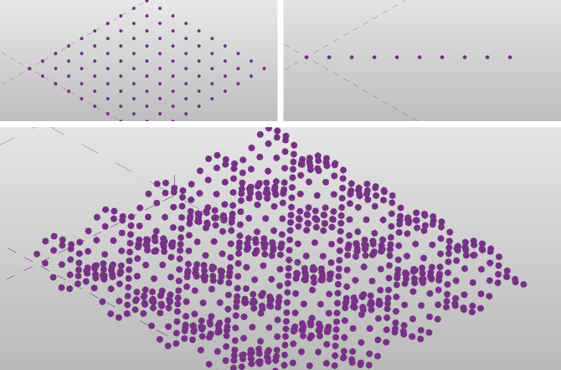
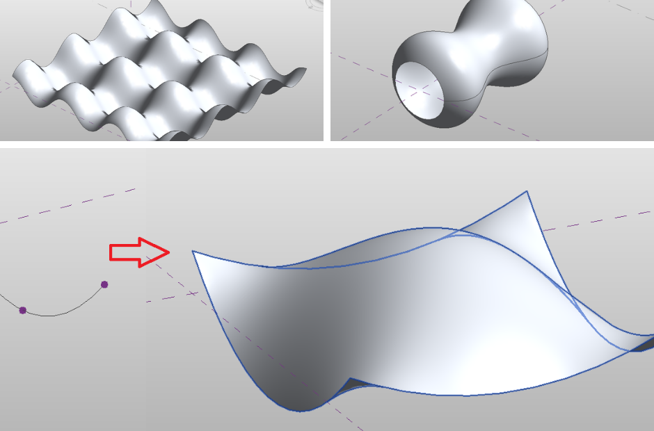

# Revit 2020+ api samples written in python

Code must be run using RevitPythonShell and within a Revit Conceptual Mass family creation environment.  

[RevitPythonShell](https://github.com/architecture-building-systems/revitpythonshell) is a Revit add-in created by Daren Thomas. The tool allows developers and designers to write Revit API commands using Iron Python. This allows for a much more fluid iterative workflow, similar to scripting environments in other programs.  
  
### Screenshots  
  
  
  

